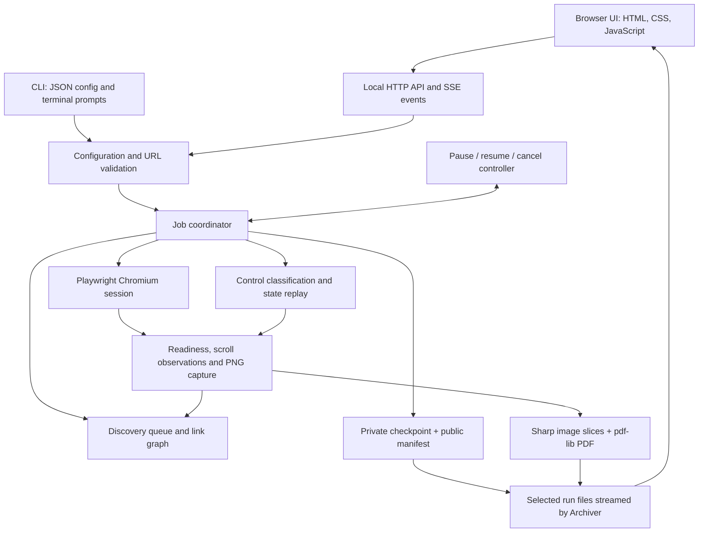
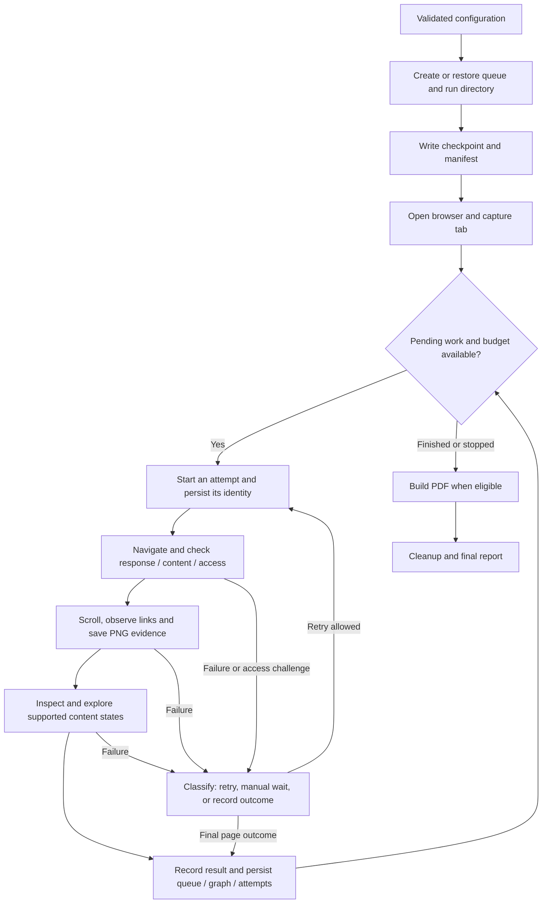
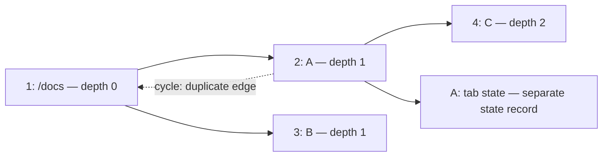
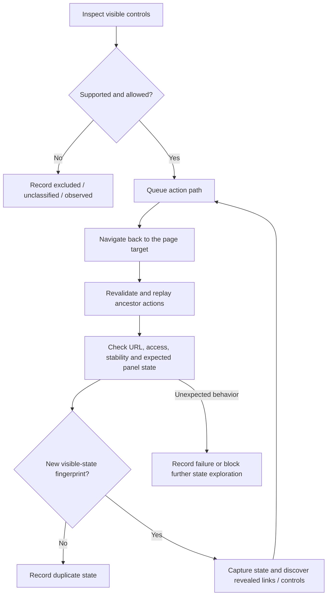
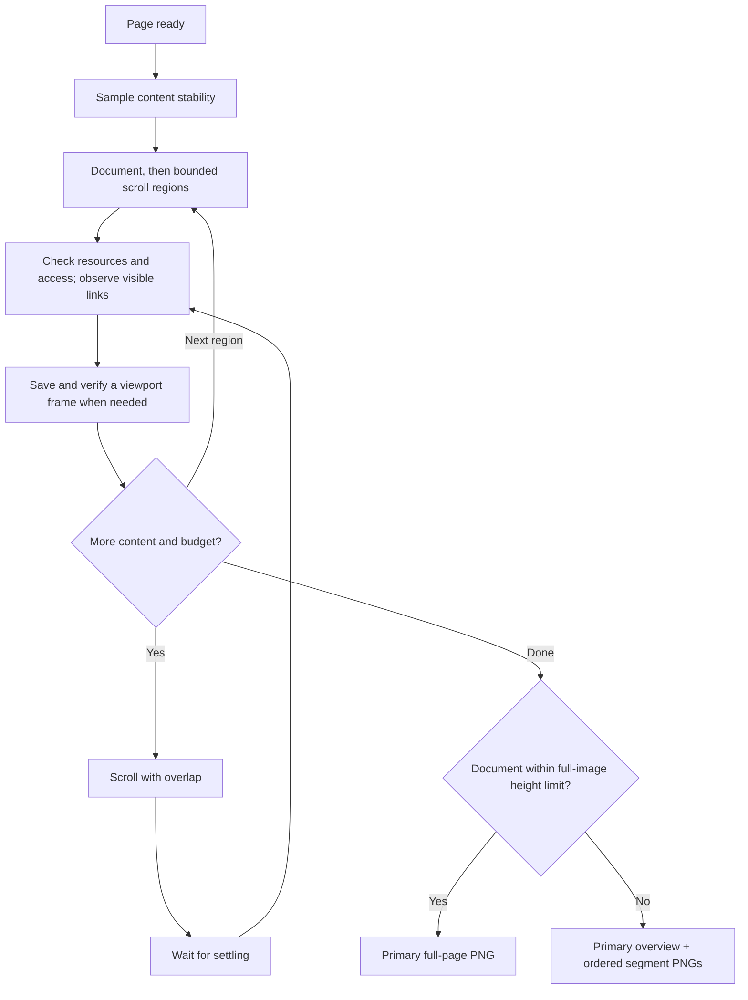
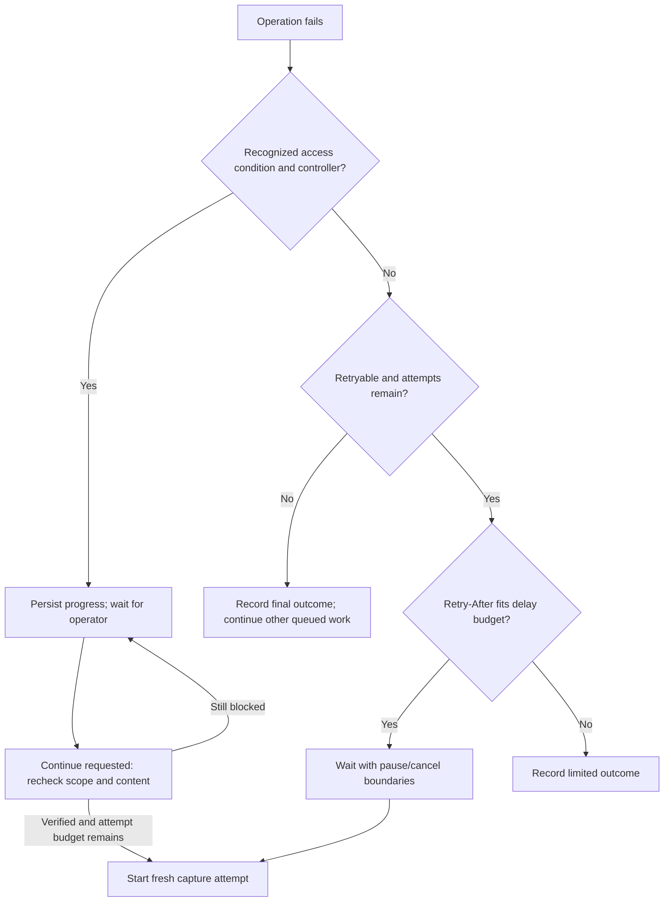
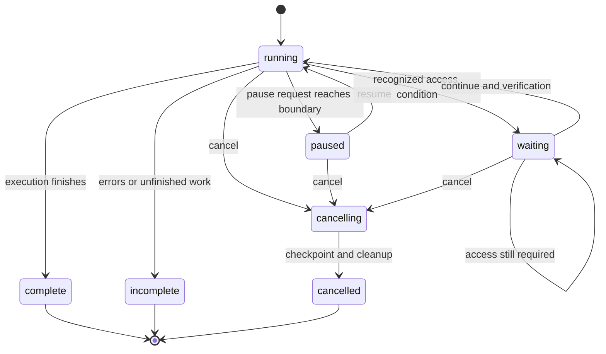
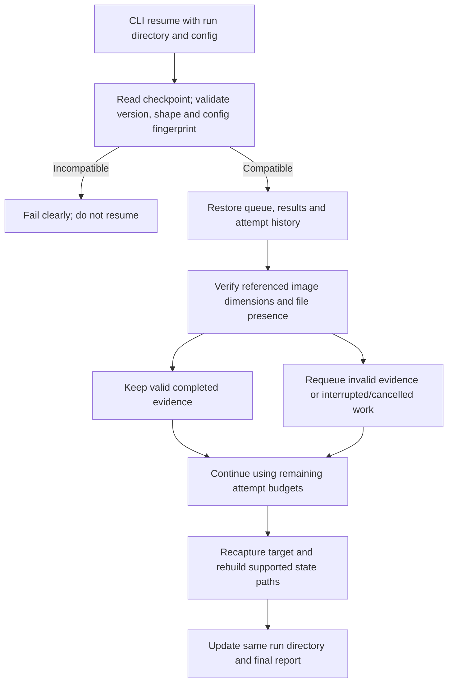
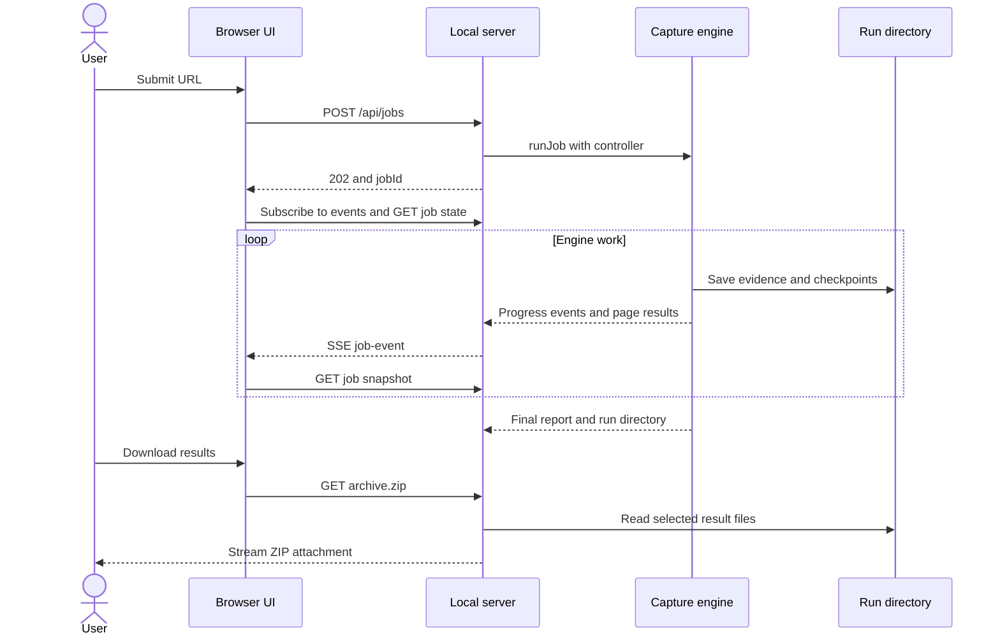
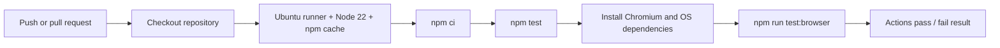

# Website Capture Tool

[](https://github.com/Wbggzade/website-capture-tool2/actions/workflows/test.yml)

A local Node.js application for capturing website pages and supported interactive states as PNG evidence, an optional PDF and a downloadable ZIP. It discovers visible links within a configured scope, preserves evidence while scrolling, records incomplete work, and supports checkpoints and manual access interruptions.

The project demonstrates browser automation, bounded graph traversal, fault classification, recovery and automated testing. Its engine uses DOM semantics and explicit rules; it does not use AI to learn a website or guarantee that every page, category or button will be captured. There is no visual baseline comparison feature.

**Start with the browser UI for a URL-only capture. Use the CLI for scope, browser, timing and exploration settings.** Authentication and CAPTCHA resolution remain manual. The UI is a local prototype with known integration limitations documented below.

## Contents

- [Quick start](#quick-start)
- [Architecture and technologies](#architecture-and-technologies)
- [The engine from start to finish](#the-engine-from-start-to-finish)
- [Discovery: pages and ordering](#discovery-pages-and-ordering)
- [Exploration: states within a page](#exploration-states-within-a-page)
- [Capturing long and dynamic pages](#capturing-long-and-dynamic-pages)
- [Outcomes, retries and manual access](#outcomes-retries-and-manual-access)
- [Pause, cancel and checkpoint recovery](#pause-cancel-and-checkpoint-recovery)
- [Outputs and downloads](#outputs-and-downloads)
- [Configuration reference](#configuration-reference)
- [Local web UI and API](#local-web-ui-and-api)
- [QA strategy and evidence](#qa-strategy-and-evidence)
- [Continuous integration](#continuous-integration)
- [Known limitations and current defects](#known-limitations-and-current-defects)
- [Responsible use and data handling](#responsible-use-and-data-handling)

## Quick start

Run commands from the repository root. The application requires Node.js 22 or newer and npm. Install dependencies from the lockfile and install Playwright's Chromium:

```sh
npm ci
npx playwright install chromium
```

### Browser UI

```sh
npm start
```

Open **http://127.0.0.1:3000**, enter a website URL and choose **Start capture**. The backend launches a separate, visible capture browser. Results are stored under the repository's `captures/` directory. After the job finishes, **Download all results (.zip)** streams the available manifest, screenshots and PDF.

The browser chooses its download location or asks where to save the ZIP. The application does not select an arbitrary client folder. An incomplete or cancelled job can still offer its available evidence.

The UI constructs its own default configuration. **It does not load `capture.config.json`**, expose custom pagination selectors, or resume a checkpoint after a server restart. See [current defects](#known-limitations-and-current-defects) before relying on its live counters or pause/resume display.

### CLI and custom configuration

Copy [capture.config.example.json](./capture.config.example.json) to `capture.config.json`, edit the starting URL and scope, then run:

```sh
npm run capture -- capture.config.json
```

For example, this configuration limits discovery to a documentation section:

```json
{
  "startUrl": "https://example.com/docs/",
  "scopePath": "/docs",
  "outputDir": "captures",
  "buildPdf": true,
  "browser": { "mode": "launch", "headless": false },
  "discovery": { "maxPages": 20, "maxDepth": 2 },
  "exploration": { "maxStates": 8, "paginationSelectors": [] }
}
```

Relative `outputDir` paths resolve against the CLI configuration file's directory. Omitted options receive defaults. An additional `urls` array supplies explicit targets after `startUrl`; all targets must be inside the same origin and path scope.

To resume a saved run, provide its actual directory and the same normalized configuration:

```sh
npm run capture -- capture.config.json --resume "captures/<existing-run-directory>"
```

CLI exit code `0` means the report meets the engine's completeness rules. Exit code `1` means incomplete/cancelled work, a configuration or execution error, or an export failure. A nonzero exit code does not mean that all captured evidence was lost.

## Architecture and technologies

The browser UI and CLI are entry points to the same `runJob` engine. Browser automation runs in Node.js, not in the UI page.



| Component | Responsibility | Source |
| --- | --- | --- |
| Native HTML/CSS/JavaScript | URL form, status rendering, controls, localStorage job ID, downloads | [public/index.html](./public/index.html), [public/styles.css](./public/styles.css) |
| Node HTTP server and Archiver | Local routes, in-memory job registry, SSE and ZIP streaming | [server.mjs](./src/server.mjs) |
| CLI | Config loading, manual-access prompts and process exit status | [cli.mjs](./src/cli.mjs) |
| Configuration and URLs | Defaults, limits, scope checks, URL identity and display redaction | [config.mjs](./src/config.mjs), [url.mjs](./src/url.mjs) |
| Coordinator | Queue execution, attempts, events, result aggregation and cleanup | [job.mjs](./src/job.mjs) |
| Discovery | Visible link/control inventory, exclusions and breadth-first queue | [discovery.mjs](./src/discovery.mjs) |
| State exploration | Supported controls, action-path replay and state fingerprints | [exploration.mjs](./src/exploration.mjs) |
| Playwright | Launch or CDP attachment, navigation and browser interaction | [browser.mjs](./src/browser.mjs), [capture.mjs](./src/capture.mjs) |
| Readiness and scrolling | Access detection, resource warnings, settling, ordered screenshots | [readiness.mjs](./src/readiness.mjs), [scroll.mjs](./src/scroll.mjs) |
| Lifecycle and persistence | Cooperative control, versioned checkpoints, atomic file replacement | [controller.mjs](./src/controller.mjs), [checkpoint.mjs](./src/checkpoint.mjs) |
| Sharp and pdf-lib | Image metadata checks, slicing PNGs into image-only A4 PDF pages | [export.mjs](./src/export.mjs) |
| Node test runner | Rule tests, injected-dependency tests, HTTP tests and real-browser fixtures | [test/](./test/) |

The reviewed lockfile resolves Playwright **1.62.1**, Sharp **0.34.5**, pdf-lib **1.17.1** and Archiver **8.0.0**. [package.json](./package.json) declares version ranges; [package-lock.json](./package-lock.json) determines reproducible installation. There is no frontend framework, build pipeline or database in this implementation.

## The engine from start to finish

1. Validate the input and initialize the explicit targets, discovery queue and isolated run directory.
2. Save an initial checkpoint and manifest. Open a browser session and a capture tab with the configured viewport.
3. Take the next pending URL. Check control requests and the job duration budget at execution boundaries.
4. Navigate, check the HTTP response and visible content, and detect recognizable login/access challenges.
5. Scroll and capture evidence. Observe links as content becomes visible so temporary virtual rows can contribute targets before disappearing.
6. When discovery and exploration are enabled, classify controls and replay supported action paths to capture additional states. Feed newly observed links back into the page queue.
7. Record the page result, attempts, states, controls and warnings. Persist progress and continue with the next page when appropriate.
8. When eligible, assemble a PDF from referenced captures. Close capture tabs and the browser connection, then save the final report.



This is a bounded traversal, not a separate full-site analysis followed by capture. Discovery, scrolling and capture happen together. A page can reveal links only after a disclosure opens or a scroll region moves; the engine discovers those links incrementally.

## Discovery: pages and ordering

A **page target** is a URL queue entry. A **content state** is a supported interaction path within that page. A **capture artifact** is an image, such as an overview or scroll frame. These are separate counts: one URL can produce several states and many PNGs.

The queue preserves explicit input order and appends discovered targets in observation order, giving breadth-first traversal across URL depths. Within each DOM inspection, visible navigation links rank first, then links in `main`, then other links, preserving DOM order within each group. Scroll and state observations can add targets before the final page inspection.

| Candidate | Decision |
| --- | --- |
| Same origin, within `scopePath`, not already queued | Enqueue if page/depth budgets allow |
| Duplicate URL or cycle back to an existing target | Record a duplicate edge; do not enqueue again |
| Query variants such as `?page=1` and `?page=2` | Preserve distinct identities |
| Hash routes beginning `#/` or `#!/` | Preserve route identity |
| Ordinary `#heading` link | Treat as an in-page anchor rather than another target |
| External origin or sibling path outside the scope boundary | Record `out-of-scope` |
| Download attribute, recognized file extension, unsupported scheme | Exclude with a reason |
| Recognized action words such as logout, delete or checkout | Exclude using label/path/query heuristics |
| Known redirect destination already captured through an alias | Mark the queued destination `skipped` |

Example: `/docs` reveals A and B, then A reveals C. The URL processing order is `/docs → A → B → C`; C retains A as its parent. Opening a tab on A produces a state of A, not automatically another URL target.



Scope uses an exact origin, including scheme and port, plus a path boundary: `/docs` allows `/docs/guide`, but not `/docs-other`. Main-frame navigation outside this scope is aborted. This is not a network firewall: subresources and all browser traffic are not confined to that origin.

## Exploration: states within a page

The engine inventories visible buttons, tab roles, summaries and elements with `aria-expanded`. It classifies them before choosing an action.

| Control | Current behavior |
| --- | --- |
| Closed native `<details><summary>` | Set the parent details element's `open` property |
| Tab or expandable control | Require an associated `aria-controls` panel; click and verify panel visibility and selected/expanded state |
| Already open/selected control | Record it as observed without clicking again |
| Recognized load-more/next control | Act only when its generated selector exactly matches `paginationSelectors` |
| Disabled, form-contained or recognized destructive control | Exclude |
| Unknown control or missing panel relationship | Record as unclassified; do not guess its behavior |

Before each action, the engine re-inspects the page and checks that the control still matches its selector, kind and label, still satisfies the rules, and has a unique locator. A supported control is not assumed to be trustworthy merely because it looks like a tab.



For nested disclosures, the inner state records `Open outer → Open inner`, plus its parent page and parent state IDs. Reloading and replaying this path makes the sequence inspectable, although dynamic content can still change between replays.

During state exploration, a request route rejects methods other than GET, HEAD and OPTIONS, and a popup handler closes new windows. Unexpected navigation, write requests or popups can block exploration. This guard is installed for state exploration, not the entire initial navigation/scroll lifecycle, and cannot guarantee that a website has no side effects.

States are deduplicated using a hash of the URL, sampled visible text and control attributes. This is a structural/content heuristic, **not pixel comparison**. State-count, nested-depth and duration limits bound exploration; repeated opted-in pagination is primarily bounded by state count and duration.

## Capturing long and dynamic pages

The default capture mode preserves more than a single final screenshot:

1. Wait for sampled document height and body text to remain unchanged across two consecutive comparisons.
2. Find a bounded set of visible vertical scroll regions.
3. Scroll the document and then those regions in steps of approximately 75% of the viewport/region height, leaving overlap.
4. At each step, check content/access, wait for images and fonts within a budget, observe visible links, and save viewport frames where applicable.
5. Return to the top and save the primary image. Use a full-page image below the height threshold, or an overview with ordered segments above it.



The default full-image threshold is 12,000 pixels. `SEGMENTED_CAPTURE` alone does not make the base capture partial; reaching a scroll budget, unsettled content or resource problems does. The segments are separate images, not a stitched panorama. Nested-region frames capture the browser viewport around that region.

If scrolling fails after evidence has already been saved, the engine preserves those images and copies the first frame into a recovered overview. The result records partial evidence and a warning. Virtualized content can disappear from the DOM, so intermediate frames matter even when a later full-page image exists.

PNG verification checks nonzero file size and readable dimensions with Sharp. It does not prove visual correctness or that every item was captured. Images are made eager and checked for broken/pending loads; stability checks do not cover every CSS effect, animation, canvas or remote resource.

With `exploration.enabled: false`, capture takes a single full-page PNG after readiness/resource checks; scrolling, segmentation and control-state exploration are disabled. With `discovery.enabled: false`, only explicit targets are processed and control exploration is skipped, but scrolling still runs if exploration is enabled.

## Outcomes, retries and manual access

### Read the report at three levels

| Level | Meaning |
| --- | --- |
| `lifecycle` | Execution/control state, such as running, paused, waiting, complete or cancelled |
| Top-level `status` and `exitCode` | Overall completeness assessment |
| Page/state `status`, warnings and errors | Outcome of individual targets and action paths |

| Page outcome | Interpretation |
| --- | --- |
| `captured` | Capture completed without an incompleteness condition at that level |
| `partial` | Usable evidence exists, but some resource, scroll, discovery or state work was incomplete |
| `failed` | An operation failed and was not successfully recovered |
| `blocked` | Scope, recognizable access restrictions or interaction rules prevented work |
| `skipped` | A known redirect alias avoided repeating a page; state records can also represent duplicate states |
| `limited` | A configured limit or rate-limit outcome stopped that item |

`pending` counts queued/running entries without a final result. `attempted` counts distinct targets with an attempt; `attemptCount` counts all attempts. `limited` counts limited page results; `limits` and `limitCount` describe queue-level limits, while scroll/state limits may appear in warnings or control reasons instead.

The report is incomplete when results contain partial/failed/blocked/limited work, an export/fatal error exists, pending targets remain, queue limits were reached, or controls remain unexplored. **A complete report describes this bounded execution, not proof of complete website coverage.** Currently, unexplored controls can yield `lifecycle: complete` alongside `status: incomplete` and `exitCode: 1`; use all three fields and the details.

### Retry decisions

Selected transient failures are retryable: navigation/readiness timeouts, normalized browser crashes, HTTP 408/429/5xx and capture-exploration failures that propagate to the coordinator. A scroll failure already converted to partial evidence does not necessarily trigger a retry.

The delay is capped exponential backoff, increased to honor `Retry-After` when it fits `maxDelayMs`. A larger `Retry-After` produces a limited outcome instead of ignoring the server's delay. The default is three total attempts, with a 500 ms base delay and 10,000 ms cap. Each attempt is recorded and uses a distinct screenshot filename. A recognized browser crash triggers a reconnect before another attempt.



Page failures normally allow later queued targets to run, while the overall report stays incomplete. Browser setup/fatal execution errors stop the run; cancellation and the overall duration limit leave unattempted work visible. PDF failure preserves existing captures and records `PDF_FAILED`.

### Authentication and CAPTCHA sit inside readiness and recovery

HTTP 401/403, configured visible login/challenge/denied selectors and selected heading/alert text identify recognizable access conditions. Checks run after navigation and during capture/state work, so a challenge can interrupt an existing page as well as the first request.

With a controller, the engine enters `waiting-for-user-action`. Resolve the challenge manually in the **capture browser**, then press Enter in the CLI or Continue in the UI. The engine rechecks scope and content before retrying. Without a controller, these conditions become blocked outcomes. Detection is heuristic and may miss or misclassify a screen.

There is no CAPTCHA solver, authentication bypass, credential storage feature or exported login session. Fresh launch mode creates a new browser context; an existing authenticated Chromium context can instead be attached through a local CDP endpoint:

```json
{
  "browser": {
    "mode": "attach",
    "endpoint": "http://127.0.0.1:9222"
  }
}
```

This example is a section to merge into a CLI configuration. It requires a browser already exposing that debugging endpoint; the tool does not enable it. Use a dedicated profile. Attachment uses the first available context and opens its own capture tab. Cross-origin login redirects can conflict with the configured scope, so completing login in the attached browser before capture may be necessary.

## Pause, cancel and checkpoint recovery

Control is cooperative: requests are honored at boundaries around pages, readiness polling, retry delays, scroll steps and state replay. An in-progress browser call may finish or time out before the next boundary.



In this diagram, `waiting` means `waiting-for-user-action`. The graph describes engine control; the current UI does not reliably reflect every transition. Lifecycle completion must also be checked against report completeness as described above.

At persistence boundaries, `checkpoint.json` stores the private config, raw URL queue, graph, attempts, results, events and in-flight evidence/action paths. `manifest.json` stores the public report. Each file is written through a temporary file and rename; these are separate replacements, not a transaction across both files.



Resume requeues interrupted `running` targets, selected cancelled explorations, invalid captured artifacts, and recognized blocked access results when a controller is provided. It preserves valid completed results. Ordinary failed/limited results are not automatically reset. Attempt budgets are preserved, so requeued evidence cannot always be recaptured after exhaustion.

Recovery restarts the affected target and reconstructs exploration; it does **not** restore an exact DOM, scroll position, cookie jar or browser process. Stored action/evidence paths provide provenance. The config fingerprint checks configuration compatibility, not image content integrity; changing the local attachment endpoint alone is allowed. Checkpoints are plaintext and are not encrypted.

The overall duration clock starts again on resume, but existing queue limits remain recorded. Pauses/manual waits consume wall-clock time within the current run; budgets are not frozen while waiting. CLI Ctrl+C requests cancellation. There is no dedicated CLI pause command and no UI endpoint for durable checkpoint resume.

## Outputs and downloads

Each fresh job creates a timestamp-and-random-ID directory:

```text
captures/<run-directory>/
├── manifest.json                 # Public-format report; still review before sharing
├── checkpoint.json               # Private recovery data, including raw URLs/config
├── archive.pdf                   # Optional image-only A4 export
└── screenshots/
    ├── 0001.png                  # Primary capture for page 1, attempt 1
    ├── 0001-region-0-step-001.png # Document scroll frame, when needed
    ├── 0001-state-001.png        # Primary image of a revealed state
    └── 0001-attempt-02.png       # Primary image from a later attempt
```

Files are conditional, and state captures can have their own region/step images. Report order and parent IDs describe the traversal; filenames alone are not a full execution history. Resume may append recaptured results later in the result array, so use IDs to reconstruct relationships.

The current manifest has `version: 4` and a historical `stage: 4` field. Those fields do not mean the frontend/ZIP features are missing. The private checkpoint schema is version `1`.

| Report field | What a reviewer can inspect |
| --- | --- |
| `scope`, `discoveryEnabled`, `graph.pages`, `graph.links` | Accepted targets, parent/depth relationships and link rejection reasons |
| `discovered`, `planned`, `attempted`, `attemptCount`, `pending` | Work known to the engine and how much was attempted |
| `counts`, `stateCounts`, `unexploredControls`, `limits` | Page outcomes, state outcomes and unfinished exploration |
| `results[].attempts` | Retry/interruption history and failure codes |
| `results[].states`, `controls`, `artifacts`, `warnings` | Action paths, decisions and ordered visual evidence |
| `events` | Up to the latest 1,000 persisted engine events |
| `pdf`, `exportError`, `fatalError`, `status`, `exitCode` | Export availability and final completeness assessment |

Screenshot references on page/state records include `screenshots/`; artifact `file` fields generated by the engine are basenames relative to that folder. The current UI does not consistently account for this distinction.

PDF export walks results and their states, deduplicates referenced filenames, slices images into A4 proportions and embeds PNGs. It contains rendered images, not selectable page text or a saved HTML website. Overview and overlapping scroll frames can both appear. Export is skipped on cancellation or when the overall duration stop is reached; available evidence may therefore have no PDF.

ZIP export streams `manifest.json`, `archive.pdf` when present, and regular files under `screenshots/`. It excludes `checkpoint.json`. It can include earlier-attempt screenshots still in that directory, beyond the final result's references. It does not create a permanent ZIP file in the run directory. The individual artifact endpoint has a separate privacy limitation described below.

## Configuration reference

Defaults come from [config.mjs](./src/config.mjs). The [example configuration](./capture.config.example.json) is a complete starting point for CLI use. URL validation uses the platform `URL` parser, with a regex only to detect an existing scheme; it is not a regex-only hostname/TLD check. Bare domains receive `https://`. Only HTTP(S) URLs without embedded credentials are accepted. Syntax acceptance does not prove reachability or permission to capture.

### Main and browser options

| Option | Default | Meaning / bounds |
| --- | --- | --- |
| `startUrl` | Required | Starting target |
| `urls` | `[]` | Additional explicit targets; exact deduplication preserves order |
| `scopePath` | `/` | Allowed path boundary on the starting origin |
| `outputDir` | `captures` | Run output root |
| `capturePng` | `true` | Required; `false` is rejected |
| `buildPdf` | `true` | Enable final image-based PDF export |
| `readinessSelector` | `body` | Nonempty CSS selector expected to become visible |
| `timeoutMs` | `15000` | Operation/readiness timeout; 100–120000 ms |
| `imageTimeoutMs` | `5000` | Image/font wait; 100–60000 ms |
| `viewport` | `1440 × 1000` | Width 320–3840; height 240–2160 |
| `browser.mode` | `launch` | `launch` or `attach` |
| `browser.headless` | `false` | Visible browser allows manual access resolution |
| `browser.channel` | Omitted | Optional `chromium`, `chrome` or `msedge`; requires available browser |
| `browser.endpoint` | Required for attach | Loopback HTTP(S) CDP endpoint without query, fragment or non-root path |

Launch mode also sets locale `en-US`, timezone `UTC` and light color scheme. Attachment reuses the existing context; the tool sets its capture tab's viewport but does not recreate all launch-context settings.

### Discovery and exploration budgets

| Option | Default | Bounds / behavior |
| --- | --- | --- |
| `discovery.enabled` | `true` | Discover links and inventory/explore controls |
| `discovery.maxPages` | `50` | 1–1000 queued targets, including explicit targets |
| `discovery.maxDepth` | `3` | 0–20 URL graph depth |
| `discovery.maxDurationMs` | `120000` | 100–3600000 ms; checked between targets, not a hard process deadline |
| `discovery.maxLinksPerPage` | `500` | 1–2000 inventory/combined-inspection limit; multiple observed batches can feed the queue |
| `discovery.maxControlsPerPage` | `100` | 1–200 inventory limit |
| `exploration.enabled` | `true` | Scroll evidence and supported state exploration |
| `exploration.maxStates` | `8` | 1–50 additional state records per page attempt |
| `exploration.maxStateDepth` | `3` | 1–10 nested-control planning depth; repeated pagination has separate count/time bounds |
| `exploration.maxScrollSteps` | `20` | 1–100 per document/region capture |
| `exploration.maxScrollRegions` | `4` | 0–10 nested regions, in addition to the document |
| `exploration.maxFullPageHeight` | `12000` | 1000–20000 px; segmentation threshold in exploration mode |
| `exploration.maxDurationMs` | `60000` | 100–600000 ms; shared across capture and state exploration within an attempt |
| `exploration.settleTimeoutMs` | `1200` | 100–10000 ms per settling window |
| `exploration.settleIntervalMs` | `100` | 25–1000 ms; timeout must allow at least two intervals |
| `exploration.paginationSelectors` | `[]` | Up to 20 exact nonempty selector strings for recognized pagination controls |

### Retry and access options

| Option | Default | Bounds / meaning |
| --- | --- | --- |
| `retry.maxAttempts` | `3` | 1–5 total attempts per target |
| `retry.baseDelayMs` | `500` | 0–30000 ms |
| `retry.maxDelayMs` | `10000` | 0–60000 ms; at least the base delay |
| `access.loginSelectors` | `input[type="password"]` | Visible login indicators |
| `access.deniedSelectors` | `[data-access-denied]` | Visible access-denied indicators |
| `access.challengeSelectors` | CAPTCHA-like iframe/class/id selectors and `[data-sitekey]` | Visible challenge indicators; see example file for exact strings |

Each access option is an array of at most 20 nonempty selectors. Setting an array replaces its defaults. Unknown top-level and discovery/exploration/retry/access fields are rejected. Selector strings are checked for nonemptiness, not fully parsed as CSS during configuration validation.

## Local web UI and API

The frontend submits JSON, keeps the latest job ID in localStorage, opens an EventSource connection, and fetches job snapshots when `job-event` messages arrive. Refreshing the UI can reconnect to a job while that server process still holds it. The server's job registry is in memory; restarting it loses those IDs even though engine files remain on disk.



This sequence shows the actual transport; it does not imply that intermediate API snapshots correctly aggregate every engine update.

| Method and route | Purpose |
| --- | --- |
| `GET /` and `GET /styles.css` | Serve UI assets from the working directory's `public/` |
| `GET /api/health` | Server readiness response |
| `POST /api/jobs` | Start a job with `{ "url": "https://example.com" }`; reject invalid input or another active job |
| `GET /api/jobs/:id` | Job snapshot, report and recent events |
| `GET /api/jobs/:id/events` | SSE initial `snapshot` plus subsequent `job-event` messages |
| `POST /api/jobs/:id/control` | `{ "action": "pause" }`, `resume`, `cancel` or `continue` |
| `GET /api/jobs/:id/artifacts?path=...` | Read a path resolved inside the run directory |
| `GET /api/jobs/:id/archive.zip` | Stream selected files after the job has finished; otherwise return 409 |

The default binding is `127.0.0.1:3000`. The entry point accepts port and host arguments, so loopback is a default rather than an enforced deployment boundary. The Origin check accepts loopback origins and absent Origin headers; it is not exact same-origin authentication. There is no multi-user account system or durable job service.

## QA strategy and evidence

The central QA question is: **when capture cannot finish, does the application preserve evidence and describe the missing work honestly?** Tests exercise successful pages, negative inputs, scope boundaries, transient failures, partial output, recovery and unintended interactions.

The suite uses two npm commands. The first includes unit tests and lightweight integration tests with injected dependencies/HTTP fixtures; calling all of these pure unit tests would be inaccurate.

```sh
npm test
npm run test:browser
```

| Test file | Tests | Main evidence |
| --- | ---: | --- |
| [core.test.mjs](./test/core.test.mjs) | 12 | URL/config validation, scope boundaries, HTTP failures, readiness and redaction |
| [discovery.test.mjs](./test/discovery.test.mjs) | 11 | Queue order, cycles, exclusions, limits, graph persistence and incomplete discovery |
| [exploration.test.mjs](./test/exploration.test.mjs) | 5 | Control eligibility, pagination opt-in and inventory limits |
| [job.test.mjs](./test/job.test.mjs) | 5 | Continuing after page failures, isolated runs, PDF/setup failure reporting |
| [recovery.test.mjs](./test/recovery.test.mjs) | 8 | Retries, backoff, simulated browser crash, cancellation, artifact validation and checkpoint compatibility |
| [stage5.test.mjs](./test/stage5.test.mjs) | 5 | HTTP UI routes, duplicate jobs, ZIP contents, artifact traversal rejection and mocked manual access |
| [browser.integration.mjs](./test/browser.integration.mjs) | 2 | Real Chromium capture, error pages, broken images, redirects, discovery and PDF parsing |
| [exploration.integration.mjs](./test/exploration.integration.mjs) | 7 | Nested controls, virtual rows, infinite growth, state limits, POST blocking, load-more and disappearing regions |
| [recovery.integration.mjs](./test/recovery.integration.mjs) | 7 | Login/challenge pauses, scroll cancellation/pause, nested replay and transient state-replay failure |

The browser tests serve controlled HTML on loopback with dynamically assigned ports, use headless Chromium and save evidence in temporary directories. They do not depend on third-party websites or real accounts. CAPTCHA tests simulate recognizable challenge markup and manual resolution; they do not test or implement a solver.

### Worked QA cases

| Risk / scenario | Expected observable behavior | Existing evidence |
| --- | --- | --- |
| An unrelated promotional card appears before a valid page link | Reject the unrelated link and still enqueue the valid one | Discovery classifier and browser graph assertions |
| Page 1 returns HTTP 500 but page 2 works | Preserve page 2, record page 1 failure, return incomplete | Job test with injected failure |
| An image is broken | Keep the screenshot, record `BROKEN_IMAGES`, mark partial | Real-browser fixture and manifest assertions |
| A long page replaces virtual rows as it scrolls | Preserve ordered frames and links observed before disappearance | Scroll-region browser fixture |
| A tab-shaped control attempts a POST | Abort that request during state exploration and record a blocked state | Fixture request log confirms POST did not reach the server |
| Capture is cancelled halfway through a nested action path | Preserve progress; resume recaptures the target and rediscovers the revealed link | Recovery integration fixture |
| A saved PNG becomes corrupt | Invalidate the result and attempt recapture within the remaining budget | Recovery test using an invalidated PNG |
| A result ZIP is downloaded | Verify entries and contents; exclude the private checkpoint | HTTP/ZIP test reading the central directory and inflated bytes |

These are inspectable examples of test design, boundary analysis, negative testing, test doubles, artifact validation and regression coverage. They are stronger portfolio evidence than a claim that the tool works on every website. The tests do not establish a code-coverage percentage or universal production readiness.

### Verification record

Documentation review on **2026-10-08**, against source revision **`d9b3859`**, used Windows with Node.js **25.8.1** and npm **11.11.0**:

- `npm test`: **46 passed, 0 failed** using the existing installed dependencies.
- `npm run test:browser`: attempted but **not validated in this environment**. A direct Chromium launch failed with `spawn EPERM`; the suite was stopped after failures and a recovery wait that could not complete without a browser.
- The repository contains **16 real-browser tests**. Their presence is not a claim of a fresh passing run here.
- Isolated local HTTP probes reproduced missing intermediate aggregate counts, stale pause lifecycle reporting, and access to a synthetic checkpoint through the artifact endpoint. No real capture/private data was used.
- A fresh `npm ci`, dependency vulnerability audit and remote Actions run for this exact revision were not performed as part of this documentation review.

For a local browser run with an installed channel, the fixtures also accept `CAPTURE_TEST_CHANNEL` (for example `msedge`). `CAPTURE_TEST_OUTPUT_ROOT` preserves evidence for the exploration integration fixtures instead of their usual cleanup; it does not apply to every test file. Neither setting is needed by the configured CI workflow.

## Continuous integration

[.github/workflows/test.yml](./.github/workflows/test.yml) configures GitHub Actions to run on pushes and pull requests:



CI repeats the tests on a clean remote machine, helping reveal missing dependencies and regressions that an existing local installation can hide. It uses the same local website fixtures as development; it does not capture arbitrary public sites, deploy the application, or require real login credentials.

The workflow currently has one Ubuntu/Node 22 job. It has no browser/OS matrix, coverage gate, linter, security-audit step or artifact-upload step. Test outputs are not automatically published as a browsable evidence bundle. The badge links to live workflow results; inspect the relevant commit's run before claiming that a particular revision passed remote CI.

## Known limitations and current defects

The following are present in the reviewed implementation. This README documents them; it does not imply that they have been fixed.

| Area | Current limitation / consequence |
| --- | --- |
| Live UI counts | `runJob` calls `onResult` with one page result, but the server assigns it to `job.report` as though it were an aggregate report. Counts/results can be missing or zero until final completion. |
| UI lifecycle | The server updates its cached lifecycle for access waits and final completion, but not all pause/resume events. The controller can be paused while the API still reports running, preventing the expected Resume button from appearing. The manual-access flag also remains set after the interruption. |
| Individual artifact links | Engine artifact filenames are basenames, while the UI requests them without the `screenshots/` prefix. Those links can fail. The UI checks per-result PDF fields, while the engine returns a top-level PDF; ZIP export is the more complete results path. |
| Private checkpoint access | ZIP export excludes checkpoints, but the individual artifact route permits readable files inside the run directory, including `checkpoint.json`. Path-containment validation is not an artifact allowlist or privacy boundary. Keep the server local and treat checkpoint contents as private. |
| Completion labels | Unexplored controls can leave `status` incomplete while `lifecycle` is complete. State-level duplicate skips can also make their parent page partial under the current aggregation rule. Review details rather than treating one label as a coverage guarantee. |
| Recovery budgets | Resume preserves attempt counts. Missing/corrupt evidence or a manually resolved access challenge near the final allowed attempt may have no budget left for recapture; resolution does not grant a new attempt allowance. |
| Durable UI recovery | localStorage remembers a job ID, but server jobs are in memory. UI refresh reconnection is not recovery after a backend restart; CLI checkpoint resume is separate. |
| Request protection | Exclusion words and DOM semantics are heuristics. GET requests can still have side effects; write-request protection is limited to state exploration and may interfere with sites that fetch content using POST. |
| Coverage and limits | No comprehensive iframe/shadow-DOM traversal, horizontal-scroll capture, sitemap crawl, automatic arbitrary menu understanding, infinite-feed completion, offline HTML mirror or visual regression comparison is implemented. |
| Timing and resources | Durations are checked cooperatively, not enforced as a hard end-to-end deadline. Dynamic content may change across retries. Large sets of PNGs/PDF pages can consume substantial disk and memory. |
| Test coverage gaps | UI/API tests primarily inject mocked engine results; they do not exercise the real browser UI end to end. Some mock field shapes differ from real engine output. Recovery tests also need stronger failure cleanup/time bounds to avoid waiting indefinitely when browser startup fails. |

For manual review, inspect the final manifest alongside screenshots, state action paths and warning codes. Browser-rendered error screens, image-only pages, custom controls and third-party login flows may need configuration or may remain unsupported.

## Responsible use and data handling

Use the tool on sites you own or have permission to capture, within the access and content-use permissions you have. Authentication and CAPTCHA are handled through operator intervention, not bypass. The application does not implement robots.txt processing, licensing checks or a general consent policy; scope and action filters do not replace those decisions.

Public-format manifest URLs redact query strings and fragments and use hashes to distinguish identities. Raw URL/config data remains in the checkpoint for navigation and recovery; the local API's job snapshots also return the submitted URL. Redaction does not remove sensitive text from screenshots, paths, labels or action selectors, and hashing is not anonymization. Inspect all evidence before sharing it.

[.gitignore](./.gitignore) excludes default capture output, checkpoints, dependencies, auth folders, environment files and logs. Outputs in a custom directory and a personal CLI config are not automatically private merely because they are generated/configuration files. Review Git changes before publishing. The tracked files reviewed here contain source/configuration/tests, not the local `captures/` contents.

The current server is intended for local controlled use. It has no user authentication, target-network isolation, request-size limits, quotas or retention policy for a public multi-user service. A future hosted version would need those controls as actual implementation and tests, not only documentation.
