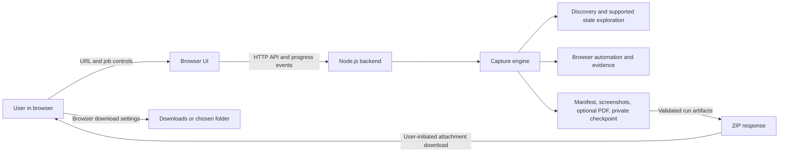

# Website Capture Tool

[](https://github.com/Wbggzade/website-capture-tool2/actions/workflows/test.yml)

Browser-accessible website capture tool. The current server runs locally on loopback for development and controlled use; a publicly hosted deployment is not implemented. The project captures bounded website content with durable checkpoints, manual access handling and resumable job control while keeping discovery and browser automation in the Node.js backend rather than frontend JavaScript.

The browser UI offers a user-initiated ZIP download of a finished run. The user's browser saves it to its configured Downloads folder or asks for a destination; the website cannot silently select or write to an arbitrary client folder. In the current loopback setup the capture backend and browser are on the same computer. Hosting the backend for remote visitors requires deployment-specific isolation, abuse protection, quotas and retention/cleanup controls before public access.

This repository contains source and test fixtures, not private captured content, personal accounts, browser sessions or authentication credentials.

## Purpose and supported scope

The tool is designed for controlled capture of a single website or a small, in-scope subset of a site through a browser UI or CLI. It supports:

- explicit target URLs and bounded same-site discovery
- ordered capture of page and state results
- manual-access interruptions for login and CAPTCHA screens
- safe retries and checkpoint/resume recovery
- relative artifact output inside an isolated run directory
- a small browser UI, job API, server-sent progress events and CLI-facing engine API
- a ZIP download containing the public manifest, screenshots and PDF when available, excluding the private checkpoint

It does not guarantee universal website coverage, complete site mirroring, or automatic solving of CAPTCHAs or login flows. The tool is intentionally conservative: unknown controls are not activated, out-of-scope links are not accepted, and budgets are reported explicitly rather than hidden.

## Architecture and actual workflow

The implementation separates the engine from the UI:

- Frontend: [public/index.html](./public/index.html) and [public/styles.css](./public/styles.css)
- Local backend API: [src/server.mjs](./src/server.mjs)
- Capture and discovery engine: [src/job.mjs](./src/job.mjs), [src/discovery.mjs](./src/discovery.mjs), [src/exploration.mjs](./src/exploration.mjs)
- Controller and lifecycle: [src/controller.mjs](./src/controller.mjs)
- Checkpoints and resume: [src/checkpoint.mjs](./src/checkpoint.mjs)
- Browser automation: [src/browser.mjs](./src/browser.mjs), [src/capture.mjs](./src/capture.mjs)

The frontend starts a job, reconnects to its state after refresh, receives structured progress events, and exposes the real lifecycle states used by the engine. After the run finishes it offers a user-initiated ZIP download. The backend never invents a parallel workflow; it reflects the same job controller, manual-access pause flow, recovery checkpoints and result status model as the CLI.



In local mode, the Node.js backend runs on the same computer and binds to loopback. If hosted later, the Node.js backend and capture browser would run on the server; only the resulting ZIP would be delivered to the visitor's browser.

## Current behavior

- Start from `startUrl` and optional additional URLs, then discover visible same-site links automatically.
- Explore in breadth-first order, with deterministic ordering and explicit limits.
- Explore supported disclosures, tabs, expandable panels and explicitly configured load-more controls; unknown and excluded controls have explicit reasons.
- Restrict targets and accepted captures to one origin and a configured path boundary.
- Preserve meaningful query parameters, fragments and trailing slashes in URL identity.
- Use visible-content readiness checks instead of course-specific words or required `main` elements.
- Reject HTTP errors, propagate readiness failures and flag recognizable access screens.
- Save a full-page PNG, verify image dimensions, and optionally assemble an image-only A4 PDF.
- Record broken or pending images as partial captures.
- Write each run into a fresh directory with relative artifact references and a manifest updated as the run progresses.
- Retry selected transient failures with bounded exponential backoff and honor `Retry-After` when it fits the configured budget.
- Keep lifecycle (`running`, `waiting-for-user-action`, `paused`, `cancelling`, `cancelled`, `complete`, `incomplete`) separate from page and state outcomes.
- Store a private versioned `checkpoint.json` beside the redacted public `manifest.json`; resume verifies artifacts and recaptures missing or corrupt evidence.
- Pause on detected login/access/CAPTCHA challenges when run through the CLI or controller API. An operator resolves them manually; the engine verifies access before retrying.
- After a job finishes, stream a ZIP containing `manifest.json`, screenshots and `archive.pdf` when present. The private `checkpoint.json` is deliberately excluded.
- Return a nonzero exit status for incomplete, cancelled, limited, blocked, failed or partial work, or export failures.

## Setup

Use Node.js 22 or newer. The project workflow is validated on Node 22 in CI and locally on Node 25.8.1.

```powershell
npm ci
Copy-Item capture.config.example.json capture.config.json
```

Edit `capture.config.json` to set the intended website and optional additional `urls`. Paths such as `outputDir` are resolved relative to the config file. The example is intentionally portable: it relies on the Playwright Chromium installation unless you explicitly set a different local browser channel.

```powershell
npx playwright install chromium
```

Run the local frontend on loopback:

```powershell
npm start
```

Then open http://127.0.0.1:3000 in a browser to start a capture. The browser UI sends work to the Node.js backend, which runs browser automation and the existing engine for discovery, retries and checkpoint/recovery.
After a job finishes, select **Download all results (.zip)**. The download contains the public manifest, screenshots and PDF when available; it deliberately excludes the private `checkpoint.json`. Your browser saves the ZIP to its configured download folder or asks you to choose a location. The app cannot silently select or write to a visitor's Downloads folder. In this checkout the backend is still loopback-only; remote visitors cannot use it until a secure hosted deployment is implemented.

Run the CLI directly:

```powershell
npm run capture -- capture.config.json
```

Continue an interrupted or cancelled run with the same configuration:

```powershell
npm run capture -- --resume captures\<run-directory> capture.config.json
```

The CLI remains the engine’s lower-level interface; the UI is intentionally small. The current backend is loopback-only and is not yet a hosted multi-user service.

`retry` defaults to 3 attempts, with a 500 ms exponential base and a 10 second maximum delay. `access` accepts generic CSS selector lists for login, denied-access and supported challenge surfaces. These are detection signals only; they do not solve CAPTCHA or enter credentials.

The engine API exports `createJobController()`, `runJob(...)` and `resumeJob(...)` from [src/controller.mjs](./src/controller.mjs) and [src/job.mjs](./src/job.mjs). A controller supports `pause()`, `resume()`, `cancel()`, `getState()` and `subscribe(listener)`. Pause and cancellation take effect at safe boundaries; an in-flight browser operation is not forcibly terminated.

## Configuration

`startUrl` is required. `urls` contains additional absolute URLs treated as depth-zero seeds; the starting URL is always captured first. Exact duplicates are removed without reordering. `scopePath` defaults to `/`; `/docs` permits `/docs`, `/docs/` and descendants, but not `/docs-other`.

## Discovery and ordering

Discovery defaults to on. Set `discovery.enabled` to `false` for explicit-URL-only capture.

The defaults are 50 pages, depth 3, 120 seconds for the crawl, 500 visible links per page, and 100 visible controls per page. Crawl time is checked between page operations. Per-page exploration also has its own deadline; pause/cancel is observed at readiness polling, scroll and state-replay boundaries. An individual browser request, image/font wait, or screenshot is allowed to finish within its own timeout.

The engine collects all visible anchors rather than stopping at the first nonempty category selector. It preserves query variants and conventional `#/route` / `#!/route` fragments. Ordinary heading fragments collapse to their document URL. Other SPA fragment conventions need future configuration. Links hidden behind supported content controls are observed when the state is opened.

The queue assigns stable IDs and parent/depth values when a URL is admitted. Repeated links and cycles are recorded without re-enqueueing. Known successfully captured redirect targets are skipped when subsequently dequeued. A redirected alias may itself still be captured when its destination was not known in advance. IDs are deterministic for the same seeds and observed DOM, not guaranteed across changing website content.

The graph records accepted, duplicate, out-of-scope, excluded-action, asset and download links. Recognizable logout, delete, checkout and similar URLs/labels are excluded. This is a conservative heuristic, not a guarantee that an arbitrary GET URL has no side effects. Forms, unknown buttons and unconfigured pagination are not activated; only supported disclosures/tabs/expanders and explicitly configured load-more controls can be explored.

Control records include their parent page, stable order, label, type, status and selector hint. Every action re-inspects the live page and checks selector uniqueness and eligibility before interaction. Controls are classified as explored, deferred, unclassified or excluded. Forms, disabled controls, destructive/unknown controls and non-opted-in pagination are not activated. Password entry and CAPTCHA completion remain manual.

## Content states and long pages

The initial page capture is retained. The engine then explores supported `<details>` disclosures, ARIA tabs, associated expandable panels, and only the load-more selectors explicitly listed in `exploration.paginationSelectors`. State jobs are processed in stable discovery order; nested states record their action path, parent state and parent page. Selector hints are revalidated during replay, state changes are checked before success, and repeated visible states are deduplicated. Unsupported or failed states remain in the report rather than being called captured.

Document scrolling and up to `exploration.maxScrollRegions` visible inner scroll regions are explored within step and duration limits. The engine waits for visible-content stability and image/font settling, re-checks access/readiness, and captures ordered viewport frames so lazy-loaded or virtualized rows that later disappear can still be represented. A verified full-page PNG is used below `maxFullPageHeight`; taller pages use an overview plus ordered viewport segments. Each artifact records its kind, order, and, for scroll frames, region/step/scroll position. PDF assembly follows result, state and artifact order. Infinite growth, removed regions, instability and missing resources are reported as partial/incomplete evidence, not completeness.

Links observed while scrolling or replaying a state are merged into the existing breadth-first discovery queue. A bounded capture does not imply that every lazy item or page on a site was found.

Reaching any discovery budget marks the result incomplete. Pending queued pages and omitted-link reasons remain visible in the report. Link/control extraction is bounded; omitted candidates cannot all be enumerated after the extraction limit. Reports include observed totals so truncation is explicit.

`readinessSelector` defaults to `body`. For dynamic sites, choose a CSS selector that identifies loaded content rather than a loading placeholder. Stability checks do not prove that every application request has finished.

`timeoutMs` controls navigation/readiness/screenshot timeouts individually; `imageTimeoutMs` bounds the image/font wait. PNG capture is required. Conflicting or old configuration fields are rejected instead of silently ignored.

Fresh launched sessions use a controlled viewport, English locale, UTC timezone and light theme. Attached sessions inherit the browser's environment; only the new capture tab's viewport is set.

## Manual authentication

You can retain an already-authorized session by attaching to a dedicated browser launched with a local debugging port and a separate profile. Finish login yourself before starting the capture. Do not use your ordinary personal browser profile.

Replace the `browser` section with:

```json
{ "mode": "attach", "endpoint": "http://127.0.0.1:9222" }
```

The tool creates its own tab in the first available context, closes that tab after the run, and disconnects its attachment. It does not export cookies or automate credentials. In launch mode, it owns and closes the browser.

Detected login, access-denied and supported challenge surfaces pause an active job for manual resolution in the dedicated browser. After Continue/Enter, the engine verifies scope, configured access signals and readiness; if those checks still fail, it remains waiting. Complete credentials, MFA and CAPTCHA manually. The engine does not record challenge input, solve challenges, or bypass access controls. Redirected pages outside configured scope cannot be accepted as captures; request routing is not a network-isolation guarantee.

## Outputs and outcomes

```text
captures/<timestamp>-<unique-id>/
  manifest.json
  checkpoint.json             # private; do not share
  screenshots/0001.png
  screenshots/0002.png
  archive.pdf                 # when enabled and usable captures exist
```

When downloaded, the ZIP is named `website-capture-<opaque-job-id>.zip` and contains `manifest.json`, `screenshots/...` and `archive.pdf` when present. The `GET /api/jobs/:id/archive.zip` route is available only after a job with a run directory has finished. It excludes `checkpoint.json` and arbitrary paths. Partial/incomplete runs can still be downloaded when evidence exists; their outcome labels remain in the manifest.

Page outcomes are `captured`, `partial`, `failed`, `blocked`, `skipped` (known redirect duplicates), and `limited` (for example, a Retry-After delay beyond the configured maximum). Explored states have their own outcomes and action paths. Job lifecycle is separate: `running`, `waiting-for-user-action`, `paused`, `cancelling`, `cancelled`, `complete`, or `incomplete`. Item failures normally leave other queued work eligible to continue; manual access challenges wait for verified resolution; exhausted time/page/state/retry budgets and export failures make the job incomplete; cancellation stops new work and preserves evidence already captured.

`complete` means all admitted pages were captured or deduplicated, export succeeded, no configured exploration limit was reached, and no deferred/unclassified controls remain. It does not prove that an entire website was explored: this bounded crawl only reports observed pages/states. It does not cover every frame, shadow root, asynchronous update, infinite feed item or site. A discovery failure preserves verified screenshot evidence as partial.

Manifest version 4 is shareable progress metadata: it includes ordered graph/results, lifecycle, item/state outcome counts, attempts, events, limits, pending work and unexplored-control counts. Query/hash variants receive opaque URL IDs so they remain distinguishable although displayed values are redacted. The separate `checkpoint.json` is private and includes raw queue/configuration state required for faithful resume; it is not encrypted. Keep the whole run directory private and do not publish or commit checkpoints. Do not put credentials in configuration or URLs.

Reports omit query values and fragments and do not serialize raw browser exception strings. Screenshot pixels and URL paths can still contain private content: inspect results before sharing. Capture only content you are authorized to access and publish; attribution and redistribution permissions are separate from access.

The PDF preserves the original image-slicing approach. It is not searchable text; fixed page boundaries can cut text or code. Generated outputs are ignored by Git.

## Verification

```powershell
npm test
$env:CAPTURE_TEST_CHANNEL = 'msedge'
npm run test:browser
```

For bundled Chromium, leave `CAPTURE_TEST_CHANNEL` unset and install Chromium first. Browser tests use owned local HTTP fixtures, not external sites or personal accounts. They cover capture failures and export, navigation order, query/hash routes, redirected aliases, supported controls, bounded scrolling, retries, manual login resolution, challenge detection, cancellation and resume.

Latest local verification: `npm test` passed 46/46 tests and `npm run test:browser` passed 16/16 fixture browser tests on Node 25.8.1. The ZIP integration test checks attachment headers, expected archive contents and exclusion of the private checkpoint. A real browser download was saved and inspected in the local Downloads folder.

GitHub Actions runs unit/job tests and local fixture browser checks on Node 22 and Chromium through [`.github/workflows/test.yml`](./.github/workflows/test.yml). The initial pushed content commit passed remote CI, but the commit was subsequently rewritten and these ZIP-download changes have not yet been verified by a new remote run. A clean `npm ci` attempt after adding ZIP support was interrupted by Windows `EPERM` while removing Sharp's DLL; clean-install verification for this exact revision remains pending.

## Current status and boundaries

Implemented: bounded discovery and supported content exploration; real job lifecycle, retries, pause/cancel and checkpoint recovery; a browser UI over a loopback Node.js API; individual artifact access; and user-initiated ZIP downloads with private checkpoints excluded.

Not implemented: a publicly hosted multi-user service. The current app is not production-hardened. Before hosting for remote visitors, add and verify tenant/job isolation, URL-fetching and network-abuse defenses, resource quotas, storage retention/cleanup and deployment monitoring. The current `npm audit` reports high-severity advisories in the locked Sharp/libvips dependency chain; review and resolve these before hosting.

Visual comparisons remain deferred. Only the listed revalidated content controls are interacted with. No complete/infinite-page guarantee is made. Subresource requests are not an SSRF security boundary.

## QA case study

The ZIP download needed to provide a convenient user action without exposing private recovery state or letting the browser choose server-side paths. The backend selects only the public manifest, screenshots and optional PDF from that job's run directory, then streams them as an attachment. Regression coverage parses the archive, checks its contents and verifies that `checkpoint.json` is absent; the artifact route continues to reject traversal paths. A real browser download was also saved and inspected.

## CV-ready project description

Browser-accessible website capture and reporting tool for bounded content collection. Built with Node.js and Playwright to validate readiness, discover same-site navigation, explore supported content states, handle manual access pauses, resume interrupted jobs from private checkpoints and export reports, screenshots, optional PDF and user-initiated ZIP downloads. The current backend is loopback-only; it is not yet a hosted multi-user service. Regression coverage includes URL validation, discovery limits, retries, cancellation/resume, access handling and artifact/download safety.
